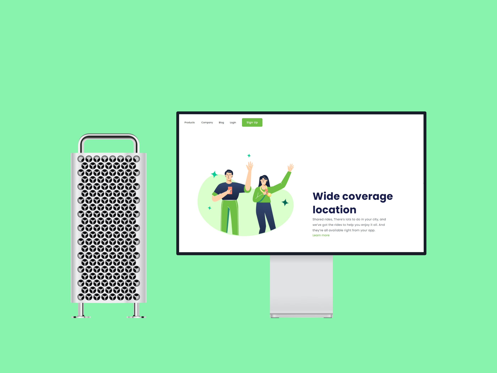

<h1 align="center"> Wide-coverage-location </h1>

 
 

<h4 align="center">Primeiro projeto de homepage desenvolvida em HTML com implementação de CSS.</h4>
<h4 align="center">Baseado em uma estrutura para versão desktop, a página foi desenvolvida em exercício proposto em ambinete de aula e 
conta com elementos pessoais oriundos através de pesquisas à respeito de técnicas auxiliares para implementação e estrutura de sites. </h4>

 

<h2 align="center">Tecnologias utilizadas no Projeto:</h2>

 

 

 
  
 
<h2 align="center">Resultado:</h2>

 

<h2 align="center">Fase do Projeto:</h2>

 <b>Status do Projeto:</b> Concluido :heavy_check_mark:

